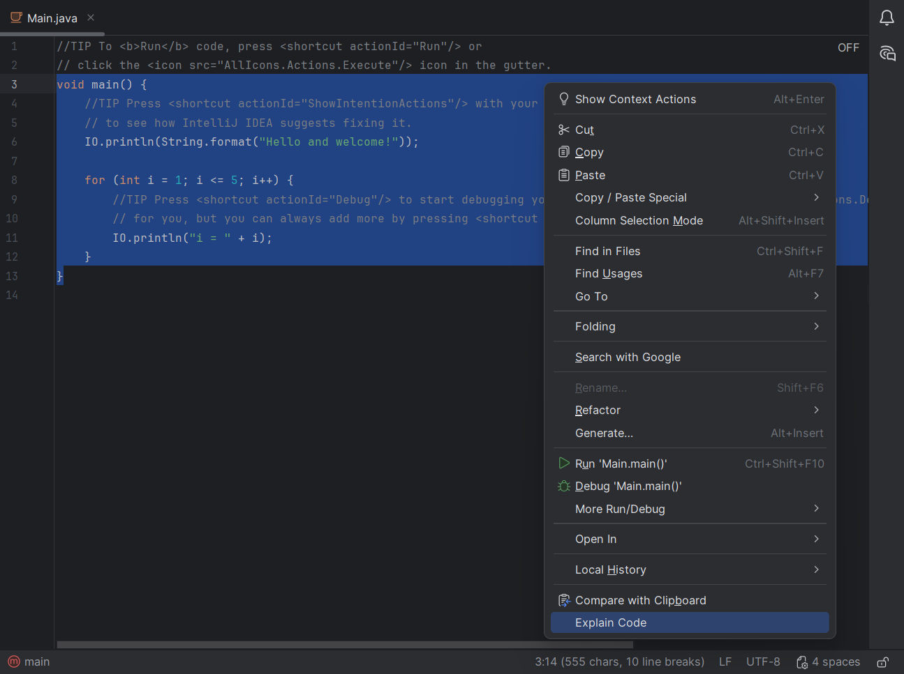
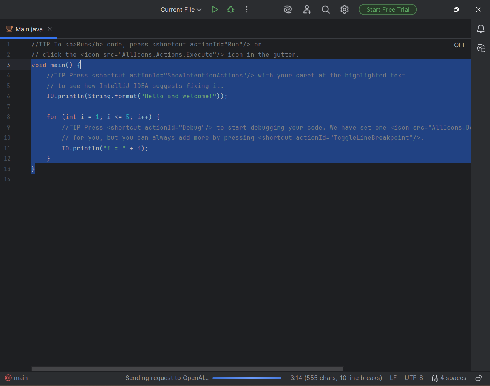
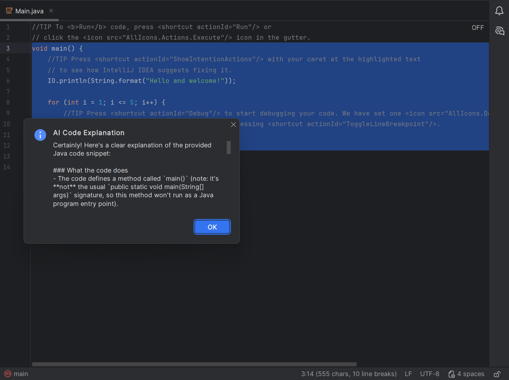

# IntelliJ AI Code Explainer

An IntelliJ IDEA plugin that provides AI-generated explanations for selected code using the OpenAI API.
Users can select code in the editor, open the context menu, and choose "Explain Code" to receive a natural language explanation directly inside the IDE.

## Features

* Explain selected code using OpenAI
* Accessible from the editor popup menu
* Background task execution to avoid UI freezing
* Error handling for API/network failures
* JSON serialization/deserialization using Jackson

## Technologies Used

* Java
* IntelliJ Platform SDK
* OpenAI API
* Jackson
* Gradle
* Java HttpClient

## How It Works

1. User selects text in the editor
2. User clicks on "Explain code" option in editor context menu 
3. Plugin creates an AI prompt 
4. Request is sent to the OpenAI API 
5. Response is deserialized using Jackson 
6. Generated code explanation is displayed in a popup dialog

## Setup

1. Clone the repository
2. Set the `OPENAI_API_KEY` environment variable
3. Run the plugin using the IntelliJ Plugin Dev configuration

## Usage

1. Open a project in IntelliJ IDEA
2. Select a piece of code
3. Right-click to open editor context menu
4. Click on option "Explain Code"
5. Wait for an AI-generated explanation

## Project Structure

```text
actions/        -> IntelliJ plugin actions
exceptions/     -> Custom exception handling
models/         -> API request/response models
services/       -> OpenAI communication and prompt building
```





